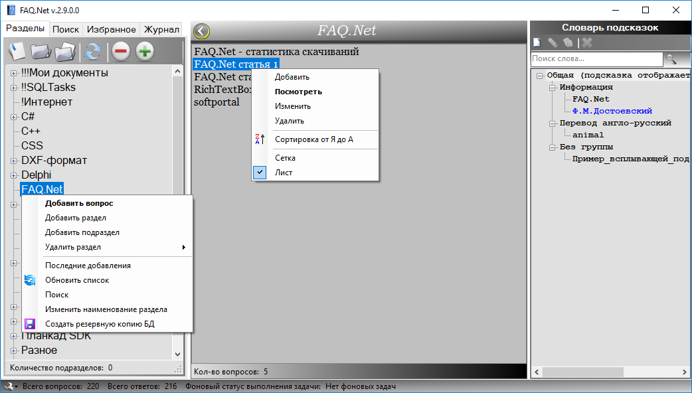
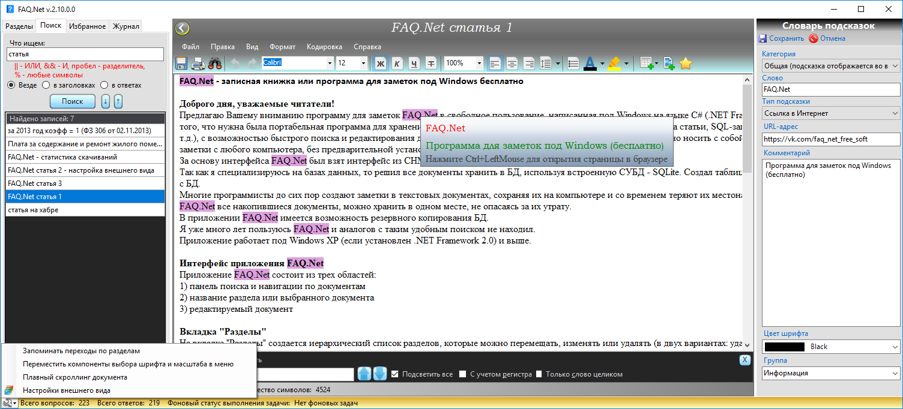

# FAQ Net — записная книжка или программа для заметок под Windows бесплатно

FAQ Net — программа для заметок, написанная под Windows на языке C#.
Простая, удобная и портативная программа для хранения накопленных знаний (копий статей из интернета, ссылки на статьи, SQL-запросы, программный код, пароли и т.д.), с возможностью быстрого поиска и редактирования документов. За основу интерфейса FAQ Net был взят интерфейс из CHM-формата (файл справки или руководство о программе).
Все данные хранятся в БД, используется встроенная СУБД — SQLite.

Многие пользователи Windows до сих пор создают заметки в текстовых документах, сохраняя их на компьютере и со временем теряют их местонахождение. Теперь, с помощью FAQ Net, все накопившиеся документы можно хранить в одном файле, не опасаясь за их утрату.
В приложении FAQ Net имеется возможность резервного копирования БД.

## Минимальные требования
Приложение работает под Windows XP (если установлен .NET Framework 2.0) и выше.

## Интерфейс приложения

Приложение FAQ Net состоит из трех областей:
  - панель поиска и навигации по документам
  - название раздела или выбранного документа
  - список документов или редактируемый документ
Интерфейс приложения пользователь может настроить под себя, изменяя цвета и шрифты, а также отображение иконок (на главной форме кнопка с изображением ключа внизу слева).

## Вкладка «Разделы»

На вкладке «Разделы» создается иерархический список разделов, которые можно перемещать, изменять или удалять (в двух вариантах: удаление вместе с содержимым и с переносом содержимого в другой раздел).

## Поиск

Поиск работает сразу по всем документам, операцией LIKE встроенной СУБД SQLite. При поиске документа можно учитывать несколько условий поиска, добавив специальные символы (|| — операция ИЛИ, && — операция И). Символ "%" означает искать любые символы.

## Хранение и редактирование документов

Все документы хранятся в RTF-формате в БД, в одном единственном файле с именем «FAQ.sqlite», который находится рядом с exe-файлом приложения (FAQ_Net.exe).
Документы можно распечатать, имеется предварительный просмотр.
Можете вставлять изображения в документы.

## Вкладка «Избранное»

На вкладке «Избранное» отображаются документы, которые пользователь помечает в области документа, нажав на пиктограмму с изображением звезды (Добавить в избранное).
При нажатии на «Добавить в избранное» документ появляется наверху в панели «Избранное». При отжатии кнопки «Добавить в избранное» документ удаляется из списка в панели «Избранное».

## Вкладка «Журнал»

На вкладке «Журнал» отображаются 50 последних документов, отсортированных по дате создания в порядке убывания (самые свежие вверху списка).

## Поиск и замена слов внутри документа

Для поиска внутри документа, необходимо нажать Ctrl+F (для замены слов нажмите Ctrl+H). После этого, внизу появится панель поиска и замены текста.

## Создание всплывающих подсказок (отображаемых при наведении на слово)

Всплывающие подсказки могут быть трех типов:
  - ссылка на вопрос - отображается наименование вопроса (заметки) с возможностью быстрого перехода к заметке внутри приложения
  - ссылка в Интернет - отображается комментарий пользователя с возможностью быстрого перехода по ссылке в браузере
  - статический текст - отображается комментарий пользователя

## Планируемый список доработок

  - Расширять список форматов: добавить возможность хранения, поиска и редактирования HTML-формата, а также XLSX-формат.
  - Для программистов будет удобным добавление функции подсветки синтаксиса для выделенного текста.
  - Добавить функцию автоматического обновления приложения.
  - На вкладке «Разделы» отделить панель списка документов от панели содержимого документа, чтобы список документов не скрывался при открытии документа.
  - Написать API чтобы хранить и обрабатывать HTML-документы при парсинге сайтов.
  - Сделать приложение FAQ Net кроссплатформенным.
  - Список пожеланий можете дополнять в группе ВКонтакте (см.ниже).

## Кому будет полезна программа заметок FAQ Net?

Приложение FAQ Net можно применять людям различных профессий и статусов. Рекомендуется использовать приложение для заметок FAQ Net: программистам, студентам и преподавателям.

Скачать Windows приложение FAQ Net (бесплатно):
  - x64 https://yadi.sk/d/sq3g4NOD3Zt7ZY
  - x86 https://yadi.sk/d/NKXeyUWH3Zt8PQ

[Группа ВКонтакте](https://vk.com/faq_net_free_soft)